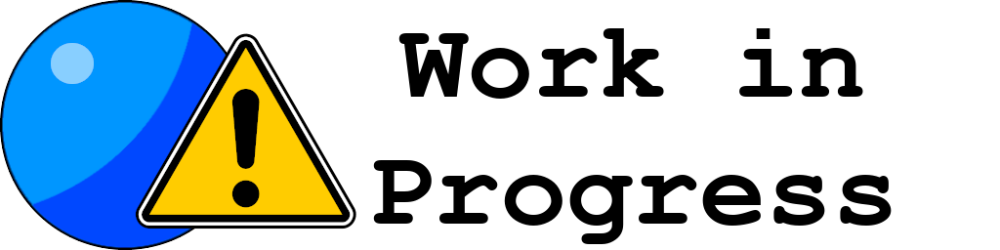

  
  

     A modular shader designed for VRChat.
  

  
  
  
  
  
   
  
  
  
  
   
   

Welcome to Toony Standard RE:Build, a shader based on the [Modular Shader System](https://github.com/VRLabs/Modular-Shader-System/) that aims to be a small shader with some base features that can be expanded via dedicated modules, giving people just what they need.

By default the shader only comes with a default pbr workflow and optional toon diffuse lighting, but if you want to add more features you can start by looking at [this page](https://github.com/VRLabs/TSR-Modules-List) where we have a selected collection of first and third party modules with additional features.

For a quick start check out the official [Documentation](https://tsr.vrlabs.dev).

## License

Toony Standard RE:Build is available as-is under MIT. For more information see [LICENSE](https://github.com/VRLabs/Toony-Standard-Rebuild/blob/master/LICENSE).

## Download

You can find the latest release in [Releases](https://github.com/VRLabs/Toony-Standard-Rebuild/releases/latest).

## Contributors

You want to help improve the library or fixing existing bugs? Feel free to contribute by sending a pr! We are always looking for improvements!

Made with [contributors-img](https://contributors-img.web.app).
